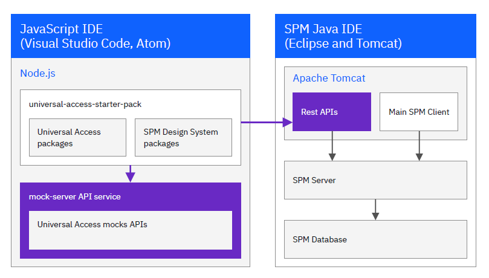

# My Curam

<!-- ## IBM Cúram Social Program Management PDF library

<https://www.ibm.com/support/pages/ibm-c%C3%BAram-social-program-management-pdf-library>

- v8.0.3
- v8.0.2, v8.0.1, v8.0.0
- v7.0.11, v7.0.9 -->

## My Curam Skills

Customize the data model based on the requirements, configure the user interface, develop business rules, test changes and deploy; dump and migrate the data; integration with other systems; eligibility determination process; case management

## My Curam Projects

<!-- ### Project 1 -->

<!-- For MCCSS / Ministry of Children, Community and Social Services-->

Worked on an open-to-public online web application of children aid app and an agency license management app

- Analyzed the old IBM Curam application, designed the new application with Angular, Material on the front-end, IBM WebSphere Application Server Liberty, Java Spring Boot on the backend, and planned the lift and shift strategy.
- Program Angular components, services, interceptions, pipes, translations, forms, data tables, animations and ad-hoc UI/UX pages with JavaScript, RxJS, Material etc.
- Developed backend RESTful API services with Java, Spring Boot, Lombok, JPA repository, Maven and Oracle etc. Utilized JUnit and Postman to run test suites.
- Used JSON Web Token JWT to implement token authorization (access token for client credential flow and refresh token with auth code flow).
- Migrated the IBM Curam Social Program Management data model to Oracle DB; Created the PL/SQL batch jobs for an initial load and some regular delta loads.
- Managed code repository, pull requests, merges and pipelines with GitLab.

## Tech

- Java 8
- Spring, Spring Boot, Spring Data, Spring JMX, Spring Batch
- WebSphere / WebLogic
- React
- EJB / JSP / Servlet / Struts
- DB2 / Oracle
- XML
- API, JSON

## Tables

- DETERMINATIONXML
- DETERMINATIONS
- DECISIONS
- {RuleSet}\_{RuleClass} (example: STREAMLINEMEDICAIDDISPLAYRULESET_STREAMLINEMEDICAIDINCOMECATEGORY)
- {RuleSet}_{RuleClass}\_LIST_{RuleAttribute} (example: STREAMLINEMEDICAIDDISPLAYRULESET_STREAMLINEMEDICAIDINCOMECATEGORY_LIST_ELIGI
  BLEMEMBERSNAMES)
- {AttributeValue} (aka AV)
- {Case}
- CASEDECISION
- CASEHEADER
- CREOLECASEDECISION
- CREOLECASEDETERMINATION
- CREOLECASEDETERMINATIONDATA
- CREOLEPRODUCTDECISIONDISPCAT
- CREOLEPRODUCTPERIOD
- CREOLEPRODUCTPERIODDISPCAT
- CREOLERULECLASSLINK
- CREOLERULESET
- PRODUCT
- PRODUCTDELIVERY
- BATCH_JOB_EXECUTION
- BATCH_JOB_EXECUTION_CONTEXT
- BATCH_JOB_EXECUTION_PARAMS
- BATCH_JOB_INSTANCE
- BATCH_STEP_EXECUTION
- BATCH_STEP_EXECUTION_CONTEXT
- IntakeProcessName
- IntakeProcessConfiguration

## Roles

- case worker
- ...

## Cúram Express Rules (CER)

In IBM SPM, the eligibility and entitlement engine uses Cúram Express Rules (CER) to apply rules to realworld data to determine eligibility and entitlement.

The following list outlines the main characteristics of the eligibility and entitlement engine:

- The starting point for case eligibility and entitlement is the product.
- A product contains all the configuration details that specify the CER rules to use for the determination of eligibility and entitlement.
- When a customer configures a product, the product's configuration can be used to calculate and store a determination result that is based on the input data. The determination result is used to generate financials and is retrieved when a caseworker views eligibility and entitlement details for the case.
- Decision display rules are used to display information about decisions in the application. For example, the decision display rules can be used to display the key criteria that is used to determine the income assistance payable to a family in need.
- The information to display comes from the display rules XML output or determination results. The results are stored in the Social Program Management database, in a BLOB type field called CREOLECASEDETERMINATIONDATA.CREOLESNAPSHOTDATA as a compressed, XML document.

## Intelligent Evidence Gathering (IEG)

IEG is an efficient alternative to traditional information gathering processes. With IEG, information is gathered interactively by displaying a script of questions that a user can provide answers to.

Questions are only displayed if they are consistent with the user's previous answers so that the user is only required to provide answers relevant to his or her needs and situation. This creates a user-friendly environment that can be effectively implemented for a range of processes including client information intake, benefit assessment triage, online eligibility assessment, and so forth.

The two main components of IEG are the Engine and the Player. IEG scripts are defined in XML and the Engine interprets the script definitions at runtime and evaluates the answers supplied by the user to determine the flow of execution. The Engine determines which pages should be displayed to the user and how many times they should be displayed. The Player presents the pages, questions and other controls to the user. IEG also builds on other elements of the Cúram Application Suite such as the Datastore (DS) and the Resource Store (RS).

## Curam Social Program Management Platform

Cúram Social Program Management Platform is a business and technology solution that delivers prebuilt health and social program components, business processes, tool sets, and interfaces on top of a dynamically configurable architecture.

Cúram Social Program Management Platform helps health and social program organizations to provide optimal outcomes for citizens, satisfy increasing demand, and lower costs for organizations.

## Cúram Child Welfare

Cúram Child Welfare is a module within the Cúram platform that focuses on managing child welfare cases and services. It provides a comprehensive system for managing information related to child protection, foster care, adoption, family support services, and more. Key features may include:

- **Case Management:** Tracking and managing information related to children, families, and cases involving child welfare services.

- **Assessments:** Conducting assessments and evaluations to determine the needs and risks associated with children and families involved in the child welfare system.

- **Workflow Automation:** Automating and streamlining processes related to case progression, approvals, and notifications to improve efficiency and compliance.

- **Reporting and Analytics:** Generating reports and analytics to gain insights into caseloads, service outcomes, and performance indicators for decision-making and continuous improvement.

## Provider Management

Cúram Provider Management is another module within the Cúram platform that focuses on managing interactions with service providers involved in delivering social services. This can include various types of providers such as foster care agencies, adoption agencies, counseling services, etc. Key features may include:

- **Provider Enrollment and Registration:** Managing the onboarding and registration of service providers in compliance with applicable regulations and standards.

- **Contract and Agreement Management:** Handling contracts, agreements, and negotiations with providers, outlining the terms and conditions of service provision.

- **Quality Assurance:** Monitoring and ensuring the quality and performance of service providers to meet established standards and objectives.

- **Payment and Billing:** Facilitating the payment process for services provided by external service providers through the management of billing and invoicing.

## Curam Data Extractor

Determinations data stores the display rules data that the caseworker application then uses to present and explain eligibility outcomes to caseworkers. Determinations data is also used for eligibility and entitlement reports. Determinations data is stored in a compressed format in the Social Program Management database, which makes it difficult to extract for use in reports. However, the IBM Social Program Management Data Extractor makes it easier to retrieve the display rule attributes of a product
rule set from the Determinations data.

To use the IBM Social Program Management Data Extractor, customers must be familiar with Cúram Express Rules (CER), specifically with display rules and the role that the rules play in relation to determination data.

Operators must be familiar with eligibility and entitlement rules. Operators must also be familiar with how to use Cúram Rules to develop eligibility and entitlement.

## IBM Universal Access Responsive Web Application 4.1.1 for IBM Cúram Social Program Management 8.0.1

Responsive Web Application client uses modern technologies, such as React JavaScript, and the IBM Social Program Management Design System to enable citizens to better access services in a browser from desktop, tablet, and mobile devices.

### Lightweight development environment

The lightweight development environment replaces the Social Program Management application with a Node.js hosted mock server. This accelerates set up and development, but can't fully replicate integration testing with the Social Program Management application. Use this environment to get started quickly.

1. Install the IBM Universal Access Responsive Web Application React development environment.

2. Configure the IBM Universal Access Responsive Web Application to connect to the mock server.

### Full development environment

In the full development environment, you install the Social Program Management Java development environment to develop and test your APIs instead of using mock APIs.

1. Install the IBM Universal Access Responsive Web Application React development environment.

2. Install the IBM Cúram Social Program Management Platform.

3. Install the IBM Cúram Universal Access Application Module.

4. Install any additional SPM components that you need:

   - To use SPM Appeals, install IBM Cúram Appeals Application Module.

   - To use SPM Verifications, IBM Cúram Verification Engine Application Module.

5. Configure the REST APIs.

### Figures

## Curam Interview Questions

[Curam Interview Questions](CuramInterviewQuestions.md)

## Curam Glossary

[Curam Glossary](CuramGlossary.md)
